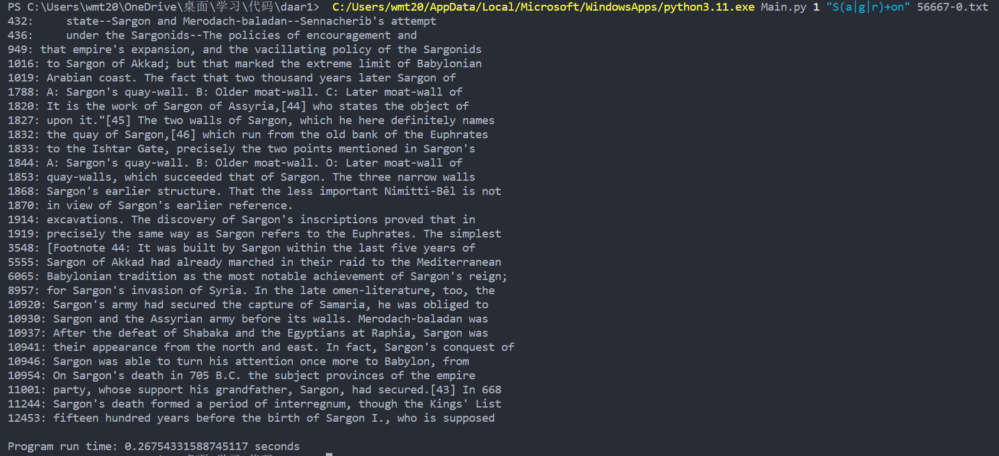

# EGREP DAAR 1

## Description

Ce répertoire contient le code source pour le projet "Clone de `egrep` avec support partiel des ERE".

## Exemple

## Utilisation

Utilisez la commande : `python Main.py <mode> <pattern> <fichier>`
Où :

* `mode` est un nombre :
  * : 0 utilise la bibliothèque python.re
  * : 1 utilise NFA
  * : 2 utilise DFA
* `pattern` est l'expression régulière :
  * Doit être entourée de guillemets simples ou doubles.
  * Supporte uniquement les chiffres, les lettres, les parenthèses, +, *, ?
* `fichier` est le nom du fichier de test :
  * Vous devez ajouter le chemin.
  * Les fichiers de test se trouvent dans le dossier `test`.

Un exemple : si vous souhaitez chercher "S(a|g|r)+on" dans le fichier 56667-0.txt en utilisant le mode DFA, vous pouvez utiliser la commande suivante :
`python Main.py 2 "S(a|g|r)+on" ./test/56667-0.txt`

